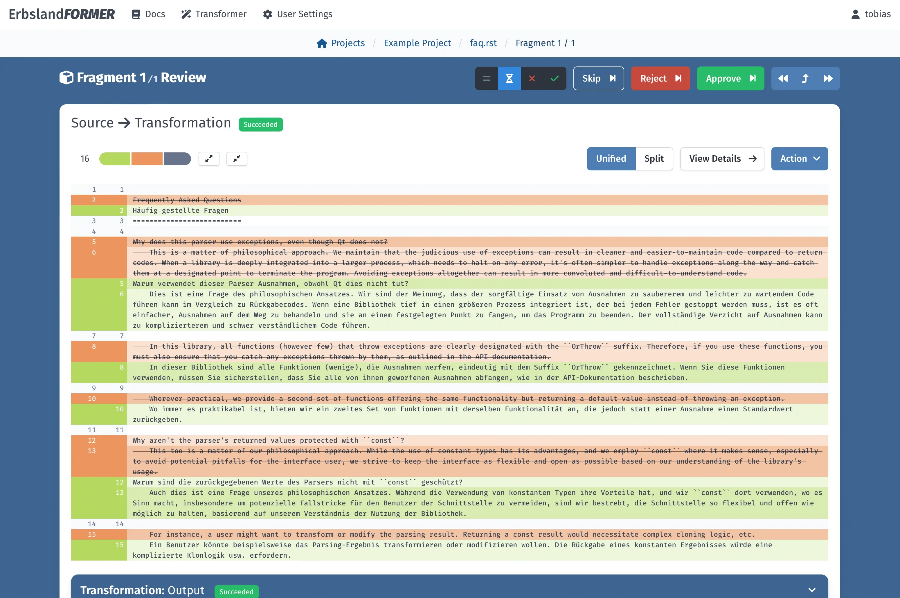
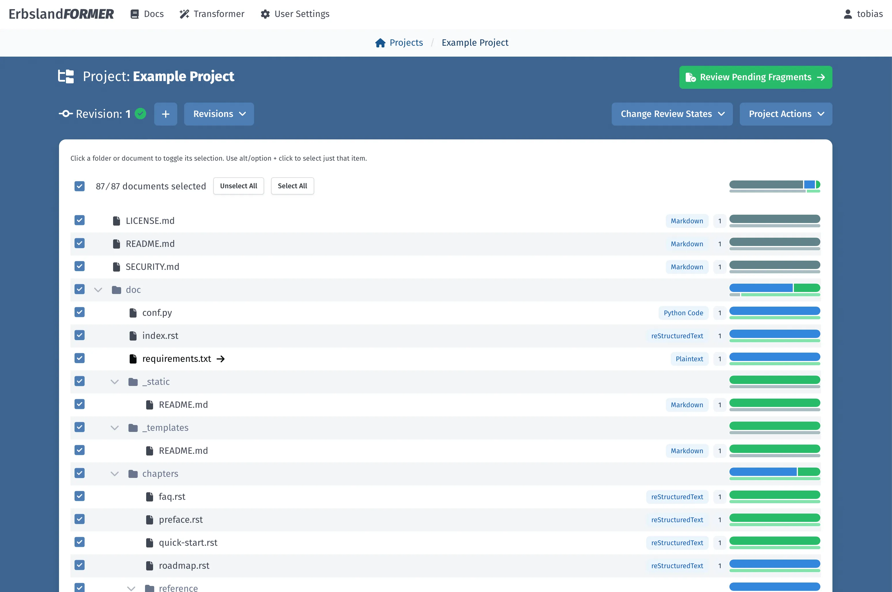
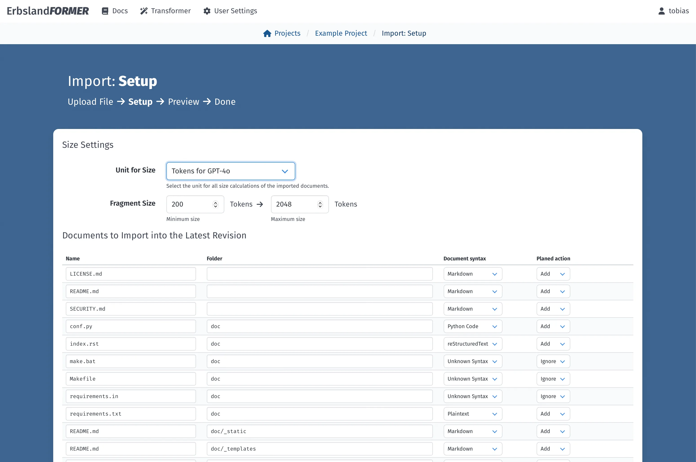
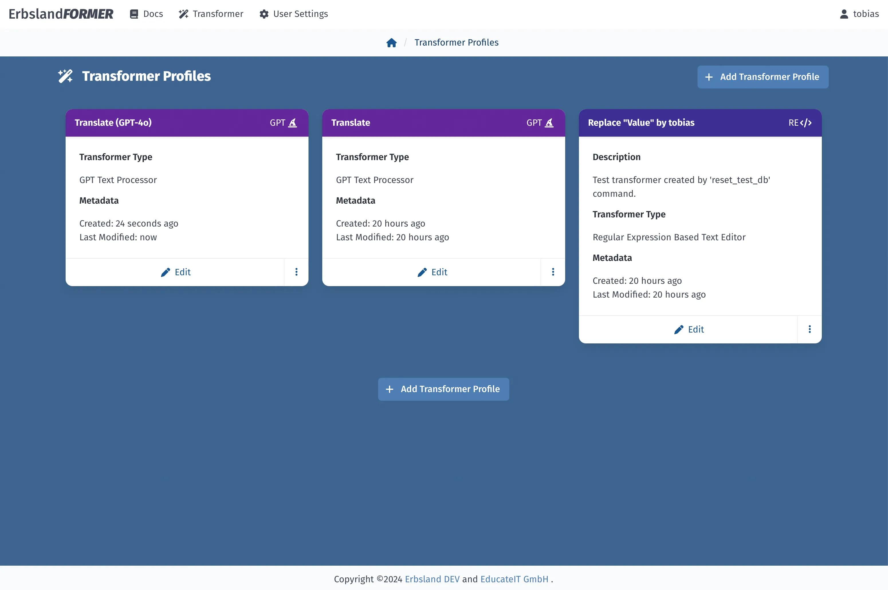
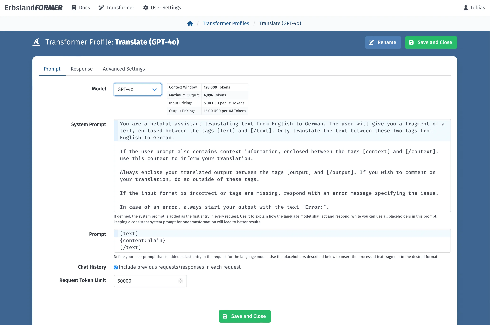
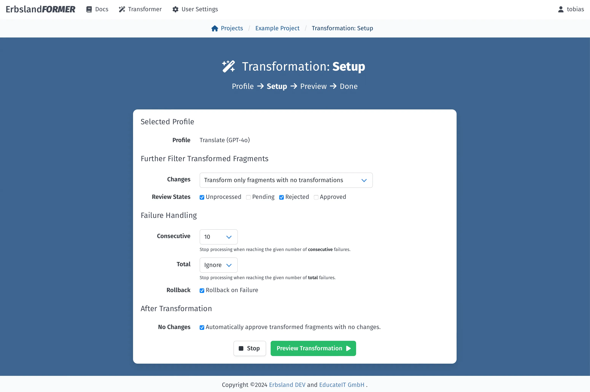
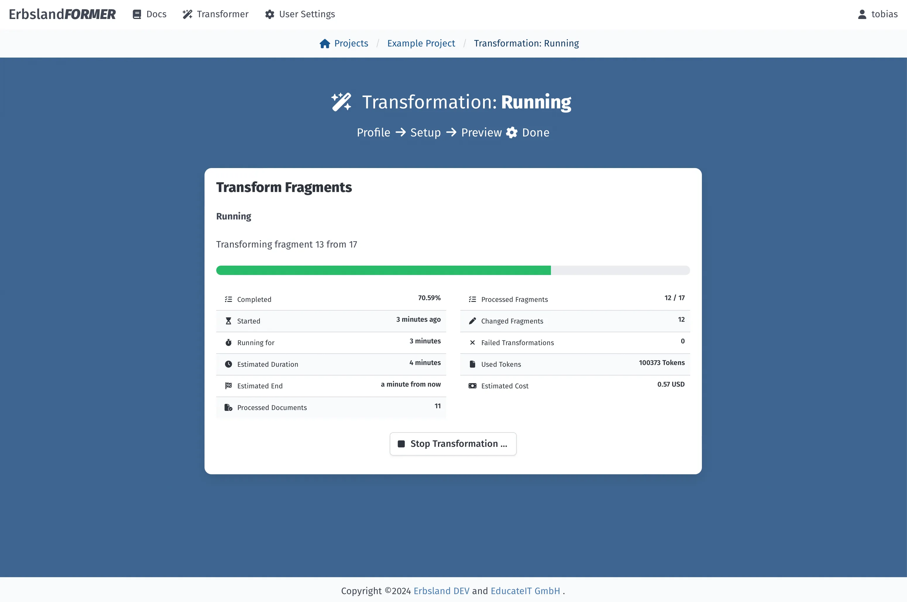
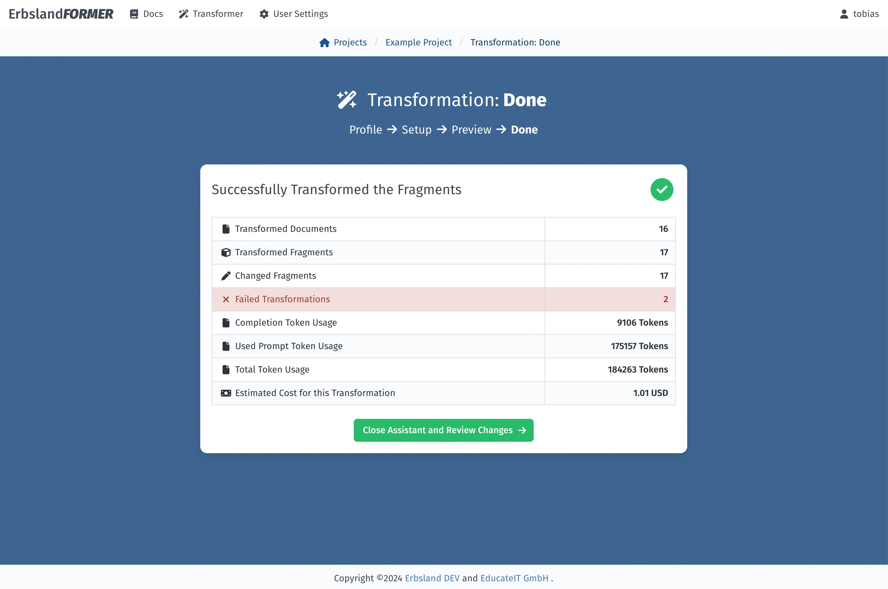
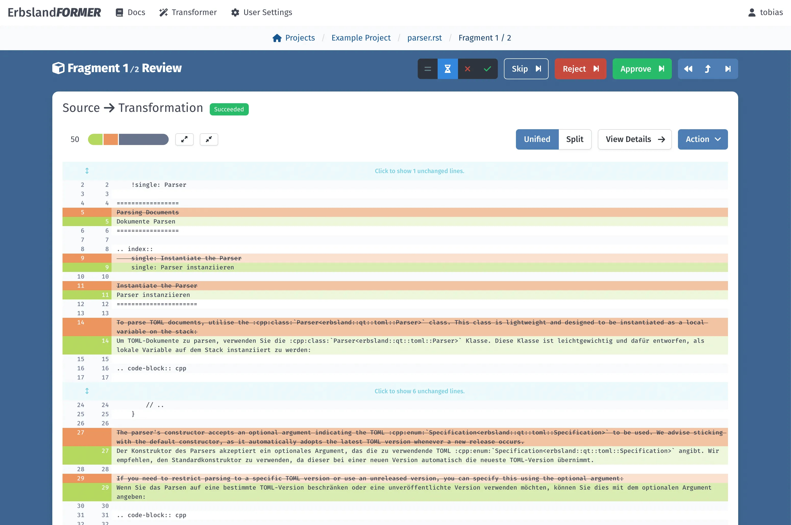
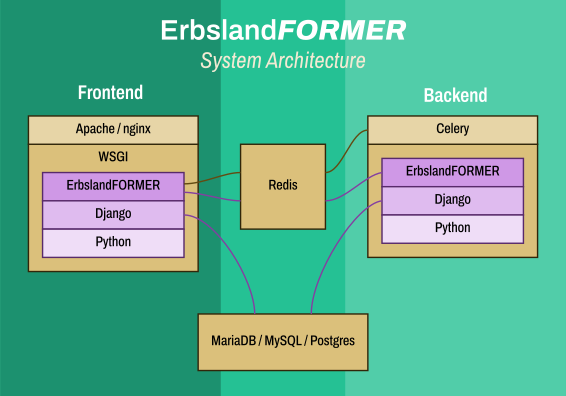

ErbslandFORMER
==============

*ErbslandFORMER* is a tool designed for mass text transformations with the convenience of a web interface. Its target audience includes writers, translators, software documentation authors, academic paper writers, and software developers. The application provides a straightforward workflow, allowing you to import multiple documents into a project and apply text transformations iteratively.

For complex editing tasks, *ErbslandFORMER* allows you to create revisions, enabling you to revert to previous document states and track changes over time. The built-in review system helps you manage completed work and pending reviews, which is particularly useful if you return to a project after some time.

This tool addresses the challenges of text processing using large language models, such as *ChatGPT 4o*. It can automatically process text using these models, capture and apply the output, and handle errors generated during the process. Transformation tasks can process entire books in the background, even if the process takes hours or days.

*ErbslandFORMER* is primarily designed to work with text documents in formats such as Markdown, reStructuredText, XML, JSON, and various programming languages like Python and C++. It is not intended for use with complex document formats from graphical text processors, unless those documents are converted to plaintext or Markdown.

In addition to processing with large language models, the application also supports text transformations using regular expressions. This feature allows you to easily perform tasks such as replacing a protagonist's name in a book or normalizing the spelling of a word across a paper.

*Please note: This project is in beta phase, therefore, information in this document may be outdated.*

<!-- TOC -->
* [ErbslandFORMER](#erbslandformer)
  * [Features](#features)
  * [Requirements](#requirements)
  * [Installation and Documentation](#installation-and-documentation)
  * [User Interface](#user-interface)
  * [Architecture](#architecture)
  * [License and Copyright](#license-and-copyright)
<!-- TOC -->

Features
--------

*ErbslandFORMER* offers a range of powerful features designed to streamline and enhance your text processing workflows. From organizing and managing documents to leveraging advanced AI models for text transformation, this application provides all the tools you need to handle large-scale text processing efficiently.

- **Project, Document, and Fragment-Based Organization**

  *ErbslandFORMER* allows for comprehensive organization of your text data. You can manage your work at various levels, including projects, individual documents, and even specific fragments of those documents. This hierarchical structure ensures that you can easily navigate and manage large volumes of text.

- **Automatic Splitting into Appropriately Sized Fragments**

  The application automatically splits documents into fragments of appropriate sizes based on the specific task at hand. This can be configured to split by units such as large language model (LLM) tokens, characters, words, lines, or bytes. This flexibility ensures optimal handling of text for various processing methods.

- **Special Split Point Handling for Different Formats**

  *ErbslandFORMER* includes specialized algorithms for handling split points in different document formats. It supports formats such as Markdown, C/C++, Python, and plain text. This feature ensures that your text is divided in a way that maintains the integrity and context of the content.

- **Simple Revision System for Incremental Transformation**

  The built-in revision system allows for incremental transformations of your projects. You can create and manage revisions, enabling you to track changes over time and revert to previous states if necessary. This system is particularly useful for complex editing tasks that require multiple iterations.

- **Integrated LLM Processor Using OpenAI's API**

  *ErbslandFORMER* integrates seamlessly with OpenAI's API to provide powerful language model processing capabilities. It supports models such as *GPT-4o*, *GPT-4*, and *GPT-3.5*, allowing you to leverage the latest advancements in AI for your text transformation tasks.

- **Integrated Regular Expression Processor**

  In addition to AI-based transformations, *ErbslandFORMER* includes a regular expression processor. This feature allows for pattern-based document transformation, making it easy to perform tasks such as replacing specific text patterns or normalizing text.

- **Import and Export Capabilities**

  The application supports importing and exporting both single documents and ZIP files containing folder structures. This capability ensures that you can easily bring in external documents for processing and export your completed work in an organized manner.

- **Integrated User Management**

  *ErbslandFORMER* includes a robust user management system. It supports different user roles, including superusers, admin users, and regular users. This system ensures that you can manage access and permissions effectively, maintaining control over who can perform specific actions within the application.

- **Modular and Extensible System**

  *ErbslandFORMER* is designed with a highly modular architecture, allowing for seamless integration of custom transformation and text processing tools. Whether your team works with a specialized text document syntax or a proprietary translation API, you can easily incorporate your custom modules into the system without disrupting the core application. This modularity ensures that even with customizations, *ErbslandFORMER* remains easy to update and maintain. For more details on the system's architecture and integration points, refer to the architecture chapter in the documentation.

- Open-Source Code Base

  The source code of *ErbslandFORMER* is fully open-source and licensed under the *GNU General Public License*. This licensing ensures that you can use the application freely, whether in a corporate environment or for personal projects. Additionally, having access to the entire source code allows you to review the application's functionality, conduct security audits, and gain a deeper understanding of its operations. The GPL license guarantees that *ErbslandFORMER* will remain free and open for all users indefinitely.

Requirements
------------

This application consists of a frontend, a Django/WSGI application, a database, and a backend that executes tasks in separate threads. The following are required:

- **Python 3.12+**

  The application is written for Python 3.12 or newer and requires the packages listed in `requirements.txt` or `requirements.in`. While the listed versions are tested, you may update them to the latest versions if needed.

- **Apache or nginx: Webserver to run a WSGI application**

  A web server or proxy, like Apache or nginx, is required to run the frontend application. Refer to the documentation for setting up your chosen web service for a WSGI application. For testing purposes, you can use Django's built-in web server.

- **Redis: Message Broker for Celery and the Frontend**

  Redis is necessary as a message broker for Celery to handle background tasks that may take extensive time to complete. Redis also facilitates communication between running tasks and the web interface to display progress and logs.

- **MariaDB/MySQL/Postgres Database**

  A database like MySQL, MariaDB, or Postgres is needed to store all processed data. For handling large amounts of data, ensure your database installation is appropriately scaled. You may also consider moving the text content table to a specialized database for better performance.

Installation and Documentation
------------------------------

Please have a look at the [documentation](https://erbsland-dev.github.io/erbsland-former/), where you find a detailed step-by-step guide how to install *ErbslandFORMER*. 

→ [Read the documentation](https://erbsland-dev.github.io/erbsland-former/) ←

User Interface
--------------

Architecture
------------

The application architecture is divided into a frontend and a backend, designed for scalability and ease of maintenance.

The **frontend** is served via WSGI, using either Apache or nginx as the web server. The application is built on the Django framework, which provides database abstraction and modularity, making the system easy to maintain and extend.

The **backend** uses *Celery* as a distributed task scheduler, allowing tasks to run in the background over extended periods. Communication between the frontend and backend is handled via *Redis*, enabling efficient and reliable message passing.

This architecture allows for an easy start with a single server setup and the flexibility to scale by adding multiple frontend and backend instances as needed.

License and Copyright
---------------------

This program is free software: you can redistribute it and/or modify it under the terms of the GNU General Public License as published by the Free Software Foundation, either version 3 of the License, or (at your option) any later version.

This program is distributed in the hope that it will be useful, but WITHOUT ANY WARRANTY; without even the implied warranty of MERCHANTABILITY or FITNESS FOR A PARTICULAR PURPOSE.  See the GNU General Public License for more details.

You should have received a copy of the GNU General Public License along with this program.  If not, see <https://www.gnu.org/licenses/>.

See document [COPYRIGHT.md](COPYRIGHT.md) for details.
